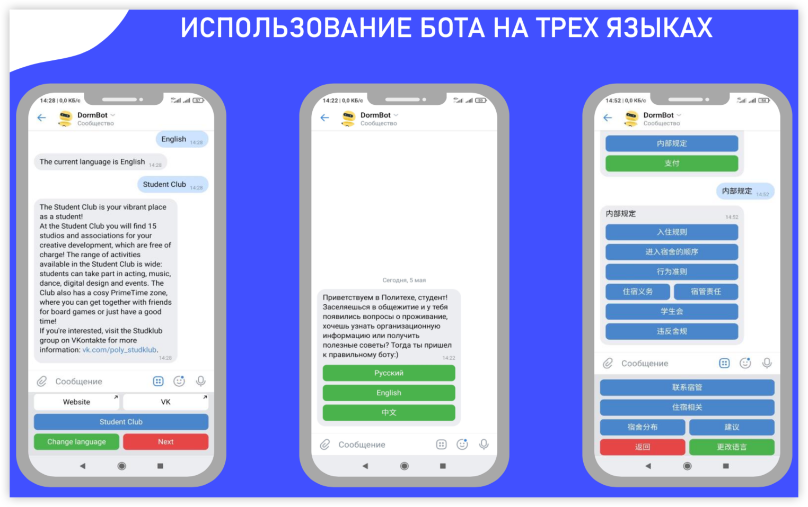
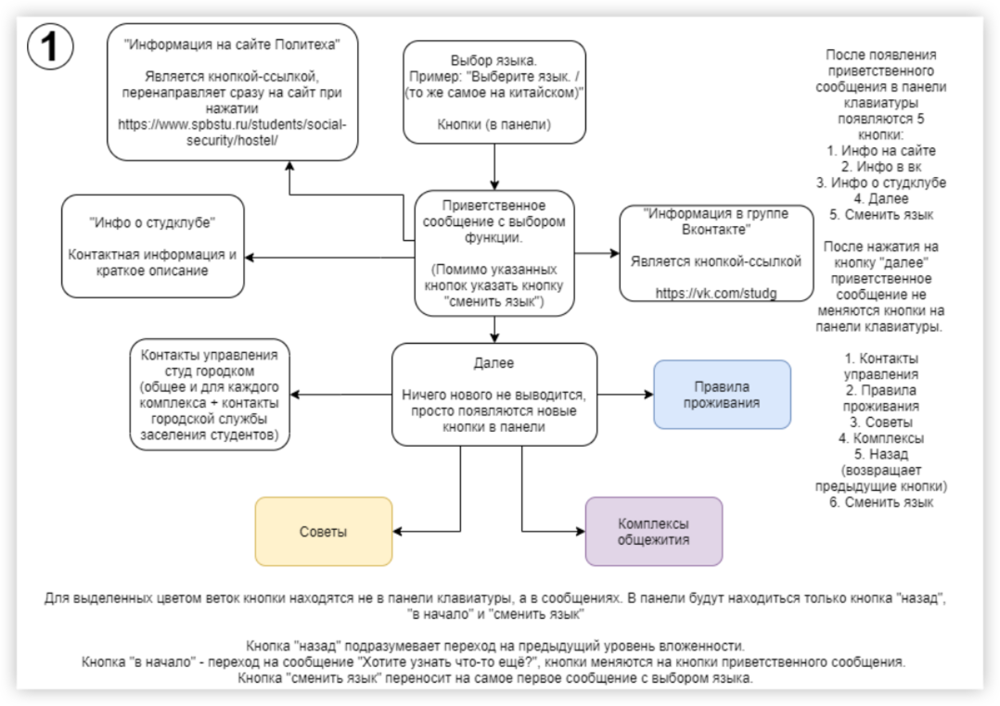
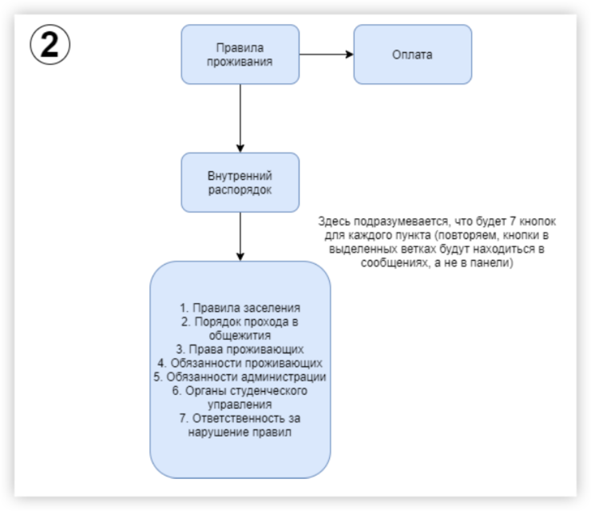
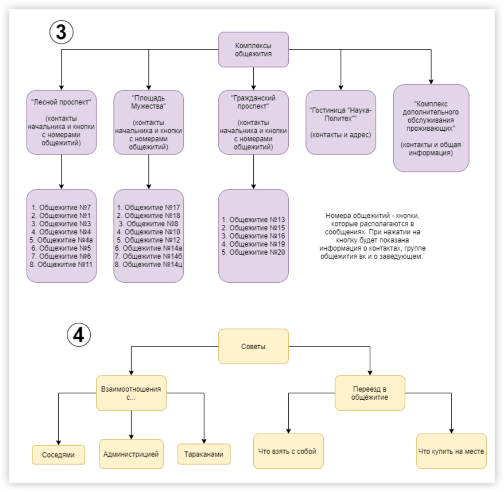

 
<b>dorm-bot</b>

 
<b>理工大学宿舍 vk 自助服务机器人</b>

<!-- 顶部至此截止 -->

[toc]

# 项目理念

本项目旨在开发一个VK聊天机器人，为宿舍居住的学生、准备搬入宿舍的本科生以及学生和申请人的家长提供服务。该聊天机器人将收集并结构化有关校园和学生俱乐部管理的联系人、宿舍楼、生活条件和搬家提示的信息。通过开发该聊天机器人，我们可以提高用户满意度，降低人力成本，提高效率并增加用户互动，从而为学生、家长和校园管理者提供更好的服务。

**有待解决的问题：**

1. 学生、申请人和他们的家长很难理解宿舍的组织方式

2. 学生发现很难找到关于学生社团和校园管理的联系信息

3. 资料中的信息没有结构化

  

**我们提供一个能满足目标受众：**

- 住在宿舍的学生。
    - 年龄：17-25岁。
    - 使用目的：寻找校园管理层和学生社团的联系人。
- 准备搬入宿舍的本科生。
  - 年龄：16-19岁。
  - 使用目的：寻找有关宿舍、规则和条件的信息，准备搬入宿舍。 
- 学生和申请人的家长，想了解宿舍生活的特殊性。
    - 年龄：35-50岁。
    - 使用目的：寻找有关其子女未来生活条件的信息。

# 项目目的

一个为学生、家长服务的聊天机器人。该聊天机器人有一个清晰和用户友好的界面和简单的导航。

它包含以下结构化信息：

1. 校园和学生俱乐部管理的联系人。

2. 宿舍楼。
3. 宿舍楼的生活条件。
4. 搬家和住在宿舍的提示。

# 项目实施

支持三种语言：

结构：

